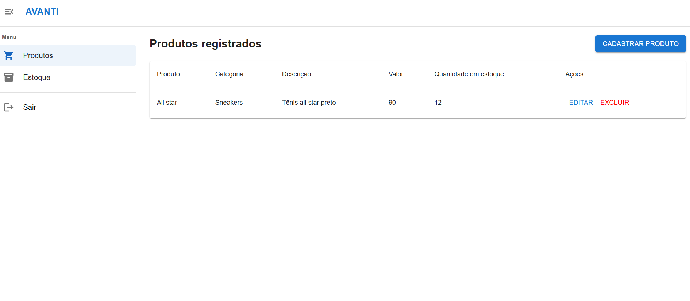

# Nome do Projeto

Projeto para gerenciamento de produtos de uma loja.

## Tecnologias Utilizadas

- React
- Vite
- Material UI

## Seções

### Página Inicial

Na página inicial, encontra-se a landing page da loja, onde os clientes podem visualizar os produtos, realizar compras e acessar informações sobre a empresa.

### Login

Login de acesso exclusivo para usuários autorizados gerenciarem os produtos da loja.

### Dashboard

Quando um usuário autorizado acessar a rota /administrador, o sistema realizará a verificação da existência de uma sessão ativa. Caso o usuário já possua uma sessão ativa, ele será automaticamente redirecionado para o painel de controle, onde poderá visualizar as informações dos produtos. Se a sessão não estiver ativa, o usuário será redirecionado para a tela de login para autenticação.

